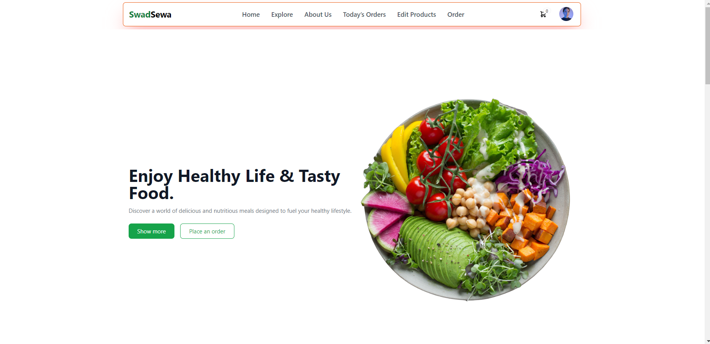
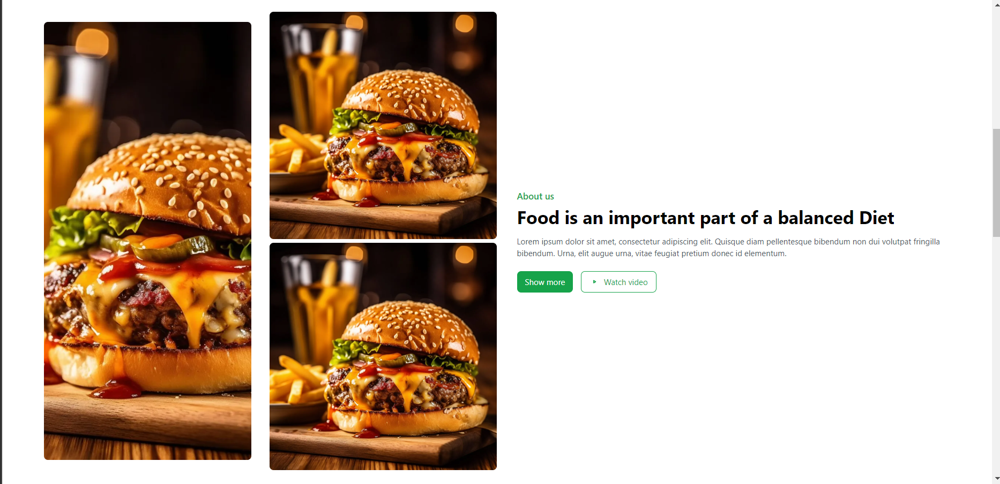
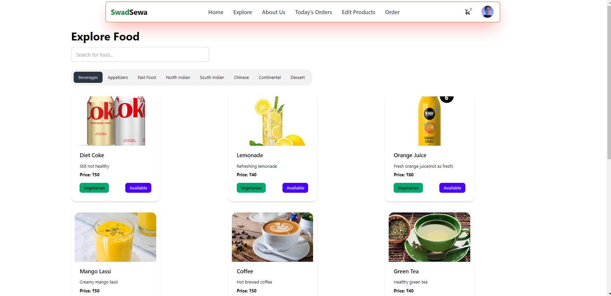
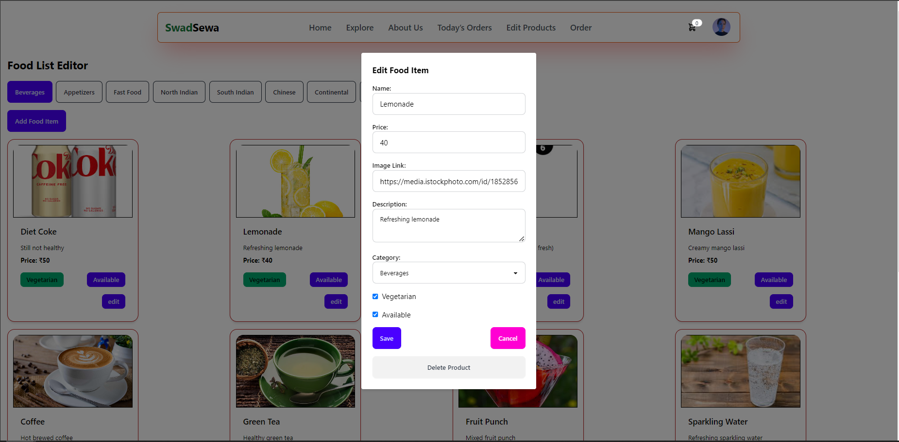
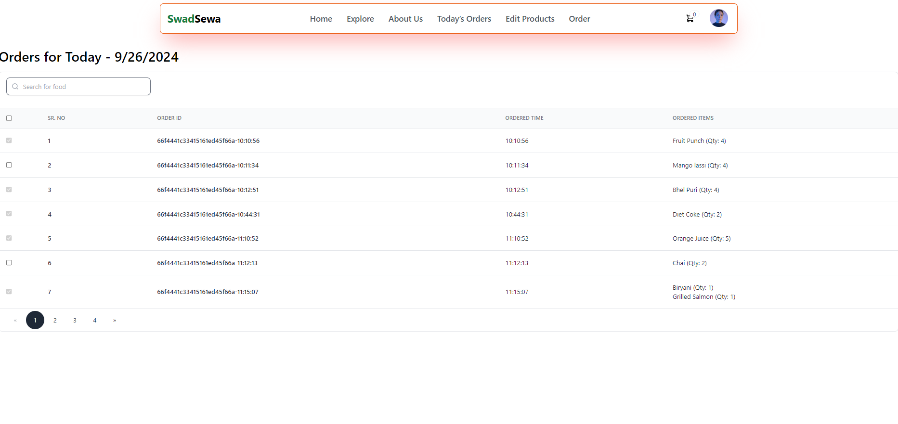
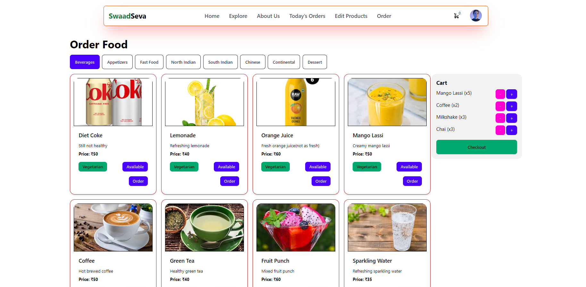
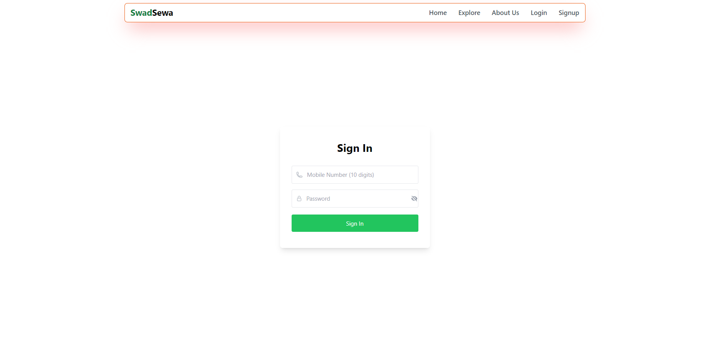
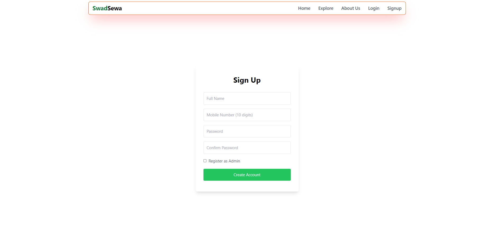
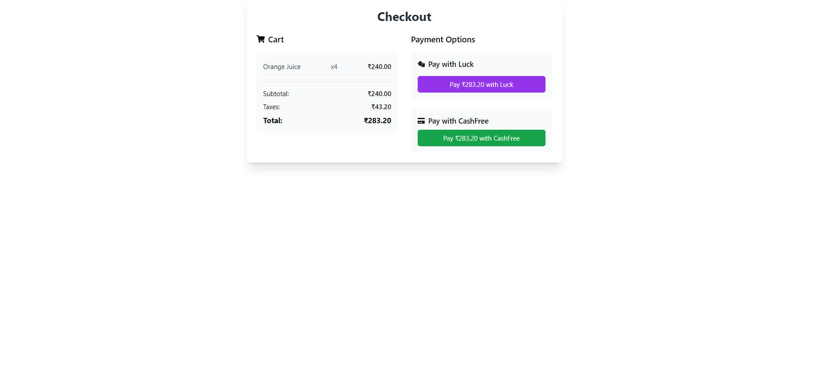

## SwadSewa: A MERN-based Food Ordering Website

**SwadSewa** is a user-friendly food ordering website built using the powerful MERN stack (MongoDB, Express, React, Node.js). It allows users to explore diverse menus, effortlessly add items to their cart, and place orders with ease.

### Features

* **Explore Menu:**  Browse a wide selection of categories including Beverages, Appetizers, Fast Food, North Indian, South Indian, Chinese, Continental, and Dessert.
* **Food Cards:** Each food item is presented with clear details like name, price, description, and a mouthwatering image. 
* **Order Management:**  Users can seamlessly add items to their cart and complete orders.
* **Real-time Cart Update:** The cart dynamically reflects changes as users add or remove items, always displaying the accurate total amount.
* **Checkout Process:** A straightforward checkout process leads to a thank you page with all order details.
* **Admin Functionality (Limited Focus):** Basic admin capabilities are included for managing orders and users. Creating an admin user requires an admin key, which is only known to main persons or stakeholders. Here is the the AdminKey:'OursNotYours'

### Tech Stack

**Frontend:**

* **React:** JavaScript library for building user interfaces.
* **Tailwind CSS:** Utility-first CSS framework for styling.
* **daisyUI:** Tailwind CSS plugin for building UI components.
* **Material Tailwind:** Material Design-inspired UI component library.
* **tw-elements-react:** React wrapper for tw-elements.

**Backend:**

* **Node.js:** JavaScript runtime environment for server-side applications.
* **Express:** Node.js framework for building web applications.

**Database:**

* **MongoDB (or your chosen database):** NoSQL document-based database.

**State Management:**

* **Recoil:** State Management library for React.

**Validation:**

* **Zod:** JavaScript library for schema validation.

### Getting Started
**Backend Installation:**

1. **Clone the repository:**

   ```bash
   git clone https://github.com/Het7892097/ToofanExpress.git
   ```

2. **Navigate to the backend directory:**

   ```bash
   cd ToofanExpress/backend  
   ```

3. **Install dependencies:**

   ```bash
   npm install  # or yarn install
   ```

4. **Start Backend Server**
```bash
   nodemon
   ```
   

**Frontend Installation:**

1. **Clone the repository:**

   ```bash
   git clone https://github.com/Het7892097/ToofanExpress.git
   ```

2. **Navigate to the frontend directory:**

   ```bash
   cd ToofanExpress/frontend  # Assuming the directory is named "frontend"
   ```

3. **Install dependencies:**

   ```bash
   npm install  # or yarn install
   ```

4. **Start frontEnd.**
 ```bash 
 npm run dev
 ```

## Screenshots

### Landing Home Page

*Landing page showcasing the welcome message.*

### About Us Page

*Details about SwadSewa on the About Us page.*

### Explore Page

*Explore a variety of food categories.*

### Food Edit and Create Page

*Admin page to edit or create food items.*

### Order List

*List of orders made by users.*

### Ordering Page

*Page for placing an order and reviewing cart items.*

### Sign In / Sign Out Page

*Page for users to sign in.*


*Page for users to sign up.*

### Checkout Page

*Page where users finalize their order and proceed with payment.*

### Thank You Page

*Thank you page showing successful order completion with an Order ID.*


### Future Improvement
- **Better UI and Responsiveness**: Improve the overall user interface design and ensure better responsiveness across various devices for an enhanced user experience.
- **Enhanced Admin Dashboard**: Provide more robust features for managing orders, users, and inventory.
- **User Reviews and Ratings**: Enable users to leave feedback on food items to help others make informed choices.
- **Improving Security**: Enhance security measures to protect user data and prevent unauthorized access.
- **Performance Improvements**: Optimize loading times and performance for a smoother browsing experience.
- **Payment Gateway**: Integration: Allow users to make payments online using various payment methods by either using Razorpay or Paytm payment-gateway.

### Contributing

I welcome your contributions!  If you'd like to be part of the SwadSewa project, simply fork the repository and submit a pull request.## SwadSewa: A MERN-based Food Ordering Website
